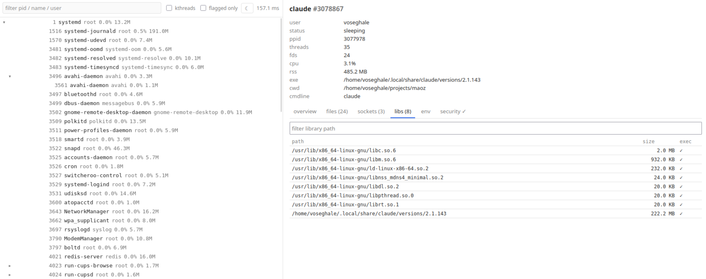
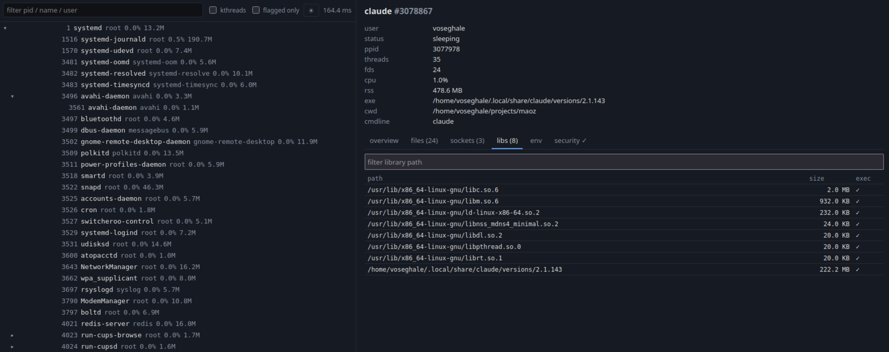

# monitor

Local browser-based Linux process & open-file explorer. Read-only, runs as
the invoking user, no root required. See [plan.md](plan.md) for the design
and [CHANGELOG.md](CHANGELOG.md) for what's shipped.




## Features

- Live process tree with virtualized rendering and `/proc`-derived metadata
- Per-process detail panel with five tabs:
  - **files** - open file descriptors classified by kind (file/dir/pipe/
    socket/anon/device/deleted), with socket addresses resolved from
    `/proc/net/*`
  - **sockets** - full network/Unix socket table from psutil
  - **libs** - shared libraries and mapped files from `/proc/<pid>/maps`,
    with deleted-file flags
  - **env** - environment variables, hidden by default; reveal toggle masks
    secret-looking keys
  - **overview** - pointer to the tabs above
- Process tree extras:
  - Search filter on pid / name / user
  - Kernel-thread subtree hidden by default; toolbar checkbox reveals them
  - New pids fade in green, removed pids fade out red, exec-without-fork
    flashes yellow
  - Dark mode toggle (persisted in localStorage)
- WebSocket diff stream - no full-page reloads, no polling
- Security signals (see [plan.md](plan.md) §"Phase 3 Section B"): flags
  suspicious exe paths, memfd/deleted executables, and kernel-thread name
  impersonation. UI surfaces firing indicators per process, not a numeric
  score.
- **Network egress panel** - every outbound TCP connection attributed to a
  pid + comm, with reverse DNS and ASN org enrichment. eBPF
  `tcp_connect` tracepoint catches sub-second connections that polling
  misses. Lives in a 10-minute rolling log so curl-and-exit still
  shows up.
- **Filesystem burst detection** — eBPF probes on `openat` (with
  O_CREAT/O_TRUNC) and `unlinkat` fire flags for processes overwriting
  or deleting files at malware-payload rates.

## Run (dev)

Backend:

```sh
python -m venv .venv && . .venv/bin/activate
pip install -e .
python -m monitor                    # binds 127.0.0.1:8765
```

Frontend (separate terminal, **pnpm only** - `npm install` is blocked via
`engine-strict`):

```sh
cd web
pnpm install
pnpm dev                             # http://localhost:5173, proxies /api and /ws
```

## Run (production-ish)

Build the frontend into `monitor/static/` and let FastAPI serve it:

```sh
cd web && pnpm install && pnpm build
cd .. && python -m monitor
# open http://127.0.0.1:8765
```

> **Build before install.** `monitor/static/` is gitignored and not present
> in a fresh clone. If you `pip install .` (or build an sdist/wheel) without
> running `pnpm build` first, the package ships with no frontend and the
> server responds `503 frontend_not_built` on `/`. Always run `pnpm build`
> before packaging or installing.

## Running as root for full visibility

Several features need elevated privileges:

| Feature | Requirement | What happens without it |
|---|---|---|
| Process tree, fds, env, sockets | none | works as the invoking user; other users' processes are visible but their fds/env aren't |
| Security signal indicators (B1–B6) | none | all signals fire normally |
| **Paranoid mode** (`[security].paranoid = true`) | helps but not required | sees pids you don't own only when run as root |
| **eBPF exec/file/connect tracing** | root or `CAP_BPF + CAP_PERFMON` | bpftrace subprocess fails to start; tool runs without these signals |
| **Network panel for other users' processes** | root or `CAP_NET_ADMIN` | only your own user's sockets appear |

Easiest dev invocation, picks up the venv's Python correctly:

```sh
sudo .venv/bin/python -m monitor --config ./monitor.toml
```

Heads-up: `sudo` resets `HOME` to `/root`. Anything that's discovered via
`~/...` paths (notably the ASN database, see below) needs to live at a
root-readable system path. The **systemd** route below handles this
cleanly.

## eBPF (optional but recommended)

Enable bpftrace-based tracing for short-lived exec/connect events and
the filesystem-burst flags. In `monitor.toml`:

```toml
[ebpf]
enabled = true
```

Install bpftrace:

```sh
sudo apt install bpftrace          # Debian/Ubuntu
sudo dnf install bpftrace          # Fedora/RHEL
```

Run the server as root (or with `CAP_BPF + CAP_PERFMON`). At startup you
should see in the log:

```
{"level": "INFO", "logger": "monitor.ebpf", "message": "eBPF tracing active"}
```

If you see `"bpftrace exited rc=…"` instead, the `stderr:` field tells
you which probe failed to attach on your kernel.

## ASN + reverse-DNS enrichment (free, recommended)

Without this you see remote IPs and PTR records. With it you also see
the AS org name - `Hetzner Online GmbH`, `Cloudflare, Inc.`, etc. -
which turns triage from "huh, an IP" into "wait, why is `node` calling
*that*?" at a glance.

### 1. Install the Python package

Install into the same Python the server actually runs as. If you launch
via `sudo .venv/bin/python …`, that's the venv:

```sh
.venv/bin/pip install maxminddb
```

### 2. Get the database file

Free MaxMind account → download `GeoLite2-ASN.mmdb`:
<https://www.maxmind.com/en/geolite2/signup>

### 3. Place it where the server can read it

Search order (first hit wins):

1. `$MONITOR_ASN_DB` (full path)
2. `~/.local/share/monitor/GeoLite2-ASN.mmdb`
3. `/var/lib/monitor/GeoLite2-ASN.mmdb`
4. `/usr/share/GeoIP/GeoLite2-ASN.mmdb`

> **Best place if you're running with `sudo` or systemd:**
> `/var/lib/monitor/GeoLite2-ASN.mmdb`. The `~/.local/share/...`
> path is silently ignored under sudo because `HOME` gets reset to
> `/root`.

```sh
sudo mkdir -p /var/lib/monitor
sudo cp ~/Downloads/GeoLite2-ASN.mmdb /var/lib/monitor/
sudo chmod 644 /var/lib/monitor/GeoLite2-ASN.mmdb
```

### 4. Verify the lookup works

```sh
sudo .venv/bin/python -c "
from monitor.enrichment import Enricher
e = Enricher()
print('reader:', e._asn_reader)
print('test  :', e._asn_reader.get('8.8.8.8') if e._asn_reader else 'no reader')
"
```

You want:

```
reader: <maxminddb.extension.Reader object …>
test  : {'autonomous_system_number': 15169, 'autonomous_system_organization': 'GOOGLE'}
```

Then restart the server. New connections show the org name; rows that
existed before the restart keep their PTR-only display until they age
out of the 10-minute window.

### Common failures

| Symptom | Cause | Fix |
|---|---|---|
| `reader: None` | `maxminddb` not installed in the venv | `.venv/bin/pip install maxminddb` |
| `reader: None` (after install) | DB is at `~/.local/share/...` but server runs under sudo | `sudo cp ... /var/lib/monitor/` |
| `reader: <Reader>` but `test: None` | Wrong DB type (e.g. GeoLite2-City instead of -ASN) | re-download specifically the ASN flavor |
| Network panel rows still show PTR only after restart | Cache populated when reader was None | wait for TTL (1 h) or restart again with the reader loaded *before* any traffic |

## Docker

The Dockerfile does a two-stage build (pnpm → python:3.12-slim). Run with
`--pid=host` so `/proc` reflects the host:

```sh
docker build -t monitor .
docker run --rm --pid=host -p 8765:8765 monitor
```

## systemd (recommended for "always on")

A sample unit lives at `packaging/monitor.service`. The shipped unit runs
as `root` (the only way to get full eBPF + paranoid coverage). Edit
`User=` if you're OK with reduced visibility - comments in the file
explain the trade-offs.

### Quick install

```sh
# 1. Install the package into a system-wide location:
sudo .venv/bin/pip install .          # or sudo pip install . for system python

# 2. Drop the unit in place + your config:
sudo cp packaging/monitor.service /etc/systemd/system/
sudo mkdir -p /etc/monitor
sudo cp monitor.example.toml /etc/monitor/config.toml
sudo $EDITOR /etc/monitor/config.toml     # set [ebpf].enabled = true if you want eBPF

# 3. Optional: ASN database
sudo mkdir -p /var/lib/monitor
sudo cp ~/Downloads/GeoLite2-ASN.mmdb /var/lib/monitor/

# 4. Start it:
sudo systemctl daemon-reload
sudo systemctl enable --now monitor
sudo systemctl status monitor
sudo journalctl -u monitor -f         # follow logs
```

### Verifying it came up correctly

```sh
# Health:
curl -s http://127.0.0.1:8765/api/health
# eBPF active? (only if you enabled it in the config)
sudo journalctl -u monitor --since "5 minutes ago" | grep -i ebpf
# Paranoid health:
curl -s http://127.0.0.1:8765/api/security/paranoid | python3 -m json.tool
```

### Why root for the system service

The unit ships with `User=root` because that's the minimum needed for
the eBPF subprocess to attach kernel probes. The hardening it applies
(`NoNewPrivileges=true`, `ProtectSystem=strict`, `ProtectHome=true`,
`PrivateTmp=true`) limits the blast radius significantly: the process
can read `/proc` but cannot write to system directories or your home.
If you don't want root, drop the eBPF features and set `User=monitor`
(create a dedicated user first with
`sudo useradd --system --no-create-home --shell /usr/sbin/nologin monitor`).

## Configuration

CLI flags > TOML config > defaults. Config-file lookup order:

1. `--config <path>`
2. `$MONITOR_CONFIG`
3. `./monitor.toml`
4. `~/.config/monitor/config.toml`

See [`monitor.example.toml`](monitor.example.toml) for the full schema.
The `[security]` table controls env-var redaction patterns and security
signal weights / allowlists.

## CLI flags

```
monitor [--host HOST] [--port PORT] [--allow-remote]
        [--log-level {debug,info,warning,error}]
        [--config PATH]
```

- `--host`: bind address. Defaults to `127.0.0.1`. Non-loopback values
  require `--allow-remote`.
- `--allow-remote`: explicit opt-in for non-loopback binds.

## Tests

```sh
pip install pytest httpx
pytest                               # backend, 20+ tests
cd web && pnpm test                  # frontend, Vitest
```

## Troubleshooting

### "Process #N has exited" the moment I click on a row

The Process Tree is a 2-second snapshot. Anything shorter-lived than
that - shell autocomplete subprocesses, git hooks, language-server
helpers, `curl`s that finish quickly - is gone by the time your click
hits the server. The 404 is honest; look in the **Network panel**
(🌐) or **Timeline panel** (⏱) for short-lived activity, both keep a
rolling history. Drop `[scanner].interval = 1.0` if you want a tighter
tree refresh window.

### "Loading pid X…" forever

Same root cause as above, but on an older build. Update to a build
that handles 404 explicitly (any commit after the
`show "process exited"` fix).

### Network panel has rows but no ASN org names

You haven't installed the MaxMind enrichment yet. See the
[ASN + reverse-DNS enrichment](#asn--reverse-dns-enrichment-free-recommended)
section above. The quick test:

```sh
sudo .venv/bin/python -c "from monitor.enrichment import Enricher; e=Enricher(); print(e._asn_reader)"
```

`None` means the database isn't reachable from the server's context.

### `sudo` runs the wrong Python

The system Python doesn't have your venv's deps:

```
ModuleNotFoundError: No module named 'uvicorn'
```

Use the explicit venv path:

```sh
sudo .venv/bin/python -m monitor --config ./monitor.toml
```

### eBPF says "bpftrace not on PATH" or "bpftrace exited rc=…"

Install bpftrace (`sudo apt install bpftrace`) and run as root.
If bpftrace is installed but exits with a non-zero rc, the `stderr:`
field in the log line names the failing probe. Most common case: one
specific kernel-trace point is unavailable on your kernel - open an
issue with the stderr text.

### Server starts but I can't reach the UI

Default bind is `127.0.0.1`. From the same machine browse to
`http://127.0.0.1:8765`. Remote access requires both
`--host 0.0.0.0` and `--allow-remote` - the second flag is an
explicit acknowledgment that the tool has no authentication.

## Security notes

- Localhost-only by default. Bind elsewhere with `--host 0.0.0.0
  --allow-remote`. There is no authentication - this is a tool for
  inspecting your own machine.
- WebSocket connections require a same-origin `Origin` header (or none, for
  CLI clients).
- Env-var values are hidden by default. Toggling "show values" still masks
  keys matching the configured redaction regex.
- Security signals are *observation only*. Nothing is killed, blocked, or
  reported off-host.
